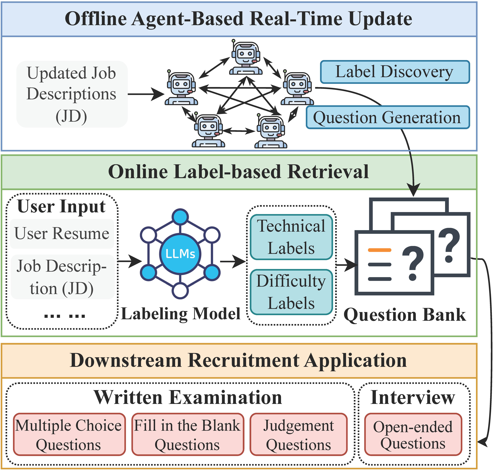

# RecruitAI: AI-Driven Real-Time Technical Recruitment System

RecruitAI is a sophisticated, AI-driven platform designed to help HR optimize technical recruitment processes by automating and enhancing online examination and interviewing process. RecruitAI leverages advanced Large Language Models (LLMs) and innovative multi-agent systems to maintain an up-to-date question bank and enable highly responsive, unbiased, and precise candidate screening. RecruitAI effectively mitigates critical issues in technical recruitment:

* **Real-Time Updates**: Automatically adapts question and label banks to current recruitment trends.
* **Low Latency**: Minimal real-time processing ensures immediate candidate response.
* **Data Efficiency**: Requires minimal supervision and no large-scale annotated datasets.
* **Bias Reduction**: Label-based retrieval minimizes biases and ensures question fairness.

RecruitAI provides recruiters with a robust, scalable solution, significantly reducing recruitment time for HRs and enhancing the quality of candidate evaluation. This repository is used to build a commercial recruitment system. We've made as much of the code public as possible, licensed under the [​​CC BY-NC-SA 4.0 License](https://creativecommons.org/licenses/by-nc-sa/4.0/)​.

<p align="center">
  
</p>

## Prerequisites

Install dependencies:

```bash
pip install torch==2.4.0 torchvision==0.19.0 torchaudio==2.4.0 --index-url https://download.pytorch.org/whl/cu118
pip install -e .
```

Set the database type (`mysql` or `sqlite`) and install that database:

```bash
export SQL_TYPE=mysql
```

Prepare your question bank in JSON format and convert it to MySQL:

```bash
python recruit_ai/application/question_json_to_db_mysql.py
```

## Functional Modules

Detailed implementation is located in `recruit_ai/application`.

* **Online Examination Question Retrieval**: Retrieves tailored questions for candidate assessments (`recruit_ai/application/question_obtain.py`).
* **Online Examination Result Evaluation**: Automatically evaluates candidate responses (`recruit_ai/application/question_result_obtain.py`).
* **Interview Question Retrieval**: Retrieves personalized interview questions based on candidate and job descriptions (`recruit_ai/application/interview_question_obtain.py` and `recruit_ai/application/interview_question_obtain_addition.py`).
* **Labeling Model**: Automatically labels inputs (résumés, job descriptions) to assist targeted question retrieval (`recruit_ai/application/tag_obtain.py`).

<p align="center">
  
</p>

## Real-Time Label Discovery Agent System

Detailed implementation is located in `recruit_ai/label_discovery`.

#### Setup

1. Prepare or preprocess Job Description (JD) data:

```bash
python json_preprocess.py
```

2. Store API keys (`deepseek_key` and `gpt_key`) securely without extensions in identical filenames:

* Utilize `get_key.py` to retrieve keys via `get_deepseek_key()` and `get_gpt_key()`.

#### Data and Label Generation

* **Direct Generation (no agent)**: Uses a single DeepSeek V3 model to generate raw labels (`label_generate_raw.py`).
* **Single-Agent Label Generation**: Uses one DeepSeek V3 agent with inspiration-driven generation (`label_generate_inspire.py`).
* **Multi-Agent Label Generation**: Utilizes chained DeepSeek V3 agents processing 25 JDs each to iteratively refine label generation (`co_agent.py`).
* **Manager Agent Optimization**: Employs DeepSeek R1 agents to refine and consolidate generated labels (`label_optimize.py`).
* **Extract Final Labels**: Extract and structure optimized labels (`label_extract.py`).

#### Label Evaluation

Quality evaluation of generated labels using:

* GPT: `evaluation_gpt.py`
* DeepSeek V3: `evaluation_v3.py`
* DeepSeek R1: `evaluation_r1.py`

#### Labeling LLM Training

* **Distillation of Labels and Categories**: Generate training data from 72B models (`jd_to_label.py`, `job_to_group.py`).
* **Evaluation of Label and Category Models**: Assess trained models with GPT (`label_model_evaluation.py`).


## Real-Time Question Generation Agent System

Detailed implementation is located in `recruit_ai/que_gen`.

* **Initial Question Generation from Labels**: `Label2Question.ipynb`
* **Iterative Question Optimization**: Refines questions based on feedback (`question_rewrite.py`).
* **Filtering Pipeline**: Removes unsuitable questions (`filter_flow.py`).
* **Data Selection via DPO Scoring**: Scores and filters using DPO (`DPO_scoring.py`).
* **Question Quality Evaluation**: Evaluates final question quality (`evaluation.ipynb`).


## Multi-Dimension Evaluation

Detailed implementation is located in `recruit_ai/final_eval`.

#### Baseline Generation

Generate baseline candidate assessments:

```bash
export CUDA_VISIBLE_DEVICES=0
python model_generate.py \
    --model_path glm-4-9b-chat \
    --exam_output baseline_exam.json \
    --interview_output baseline_interview.json
```

#### RecruitAI Outputs Generation

Run from `recruit_ai` directory:

```bash
export SQL_TYPE=mysql
python -m eval_pipeline.our_generate \
    --exam_test_case eval_pipeline/exam_test_case.json \
    --interview_test_case eval_pipeline/interview_test_case.json
```

#### Merge Baseline and RecruitAI Outputs

```bash
python merge.py \
    --baseline_path baseline_exam.json \
    --our_path our_exam.json \
    --output_path both_exam.json

python merge.py \
    --baseline_path baseline_interview.json \
    --our_path our_interview.json \
    --output_path both_interview.json
```

#### Evaluation

Update API details in `evaluation.py` and run evaluation:

```bash
python evaluation.py \
    --input_file both_exam.json \
    --output_file judge_exam.json \
    --judge_type exam \
    --metrics match,difficulty_level,correctness_rationality,duplication,practice_theory

python evaluation.py \
    --input_file both_interview.json \
    --our_for_match_file our_interview_for_match.json \
    --output_file judge_interview.json \
    --judge_type interview \
    --metrics match,difficulty_level,correctness_rationality,duplication,practice_theory
```

#### Results Visualization

Present evaluation results clearly:

```bash
python show_judge_result.py \
    --input_file_exam judge_exam.json \
    --input_file_interview judge_interview.json \
    --metrics match,difficulty,c_r,dup,p_t,inf
```
